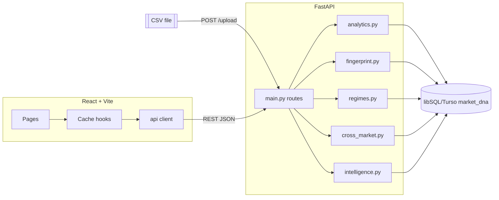

# QUANT VECTOR — Architecture

```
CSV upload                          Market data fetch (v0.10)
    │  (Date, Open, High,               │  Yahoo Finance via yfinance
    ▼   Low, Close, Volume)             ▼
FastAPI (main.py) ── validation & cleaning (analytics.py)      provider abstraction (data_sources/)
    │                                                          │  search + fetch + strict
    ▼                                                          ▼  normalize_ohlcv
libSQL/Turso (market_dna)  ◄──── parameterized queries, cascade deletes, JSON caches, INSERT IGNORE appends
    │
    ▼
Quant engines            fingerprint.py ─► analogues
                         regimes.py      ─► PCA + KMeans regimes
                         cross_market.py ─► correlations / beta
    │
    ▼
Intelligence layer (intelligence.py) ── evidence fusion + result cache
    │
    ▼
REST API (JSON)
    │
    ▼
React frontend (Vite) ── dashboard pages, market library, multi-asset overview heatmap,
                         comparison workspace, AI analyst page, report export
```

## Database architecture (v0.11.0)

libSQL/Turso (`market_dna`) is the canonical source of truth. Responsibilities are
strictly separated: providers acquire, libSQL/Turso persists, Quant Vector analyses,
the frontend visualizes, the AI interprets.

```
RAW / SOURCE DATA                 ANALYSIS / CACHE DATA
  datasets  (PK id)                fingerprints        (UQ dataset_id+metric)
  price_data (UNQ dataset_id+date) analogue_matches    (UQ dataset_id+rank)
  dataset_sources (1:1 provenance) regime_models ──┐ regime_assignments
                                                   └ (FK model_id)
                                   intelligence_snapshots (UQ dataset+param_hash)
CONFIGURATION                     ALL children FK → datasets (ON DELETE CASCADE)
  comparison_presets               except regime_assignments → regime_models
```

Every analysis loads observations through `database.get_prices()` — never from
a provider response held in memory. `test_roundtrip.py` proves analysis works
after the original provider DataFrame is destroyed.

## Stepped ingestion (v0.18.0)

Long symbol imports cannot rely on background threads on serverless
platforms: once the HTTP response returns, the function may be frozen or
reclaimed, silently killing an in-flight download. Imports are therefore
a **client-stepped state machine** persisted in `ingestion_jobs`:

```
POST /market/import            -> job QUEUED (request + cursor persisted)
POST /market/import/step  ...  -> one provider window per call (IMPORT_CHUNK_DAYS)
                                 FETCHING -> VALIDATING -> WRITING -> next window
GET /market/import/status      -> snapshot (in-process registry, else storage)
```

Invariants: the resume cursor advances only after a chunk is durably
stored (a crashed step retries its exact window); dataset metadata is
refreshed after every chunk, so even a half-imported dataset has
consistent rollups; the first step attaches to a prior import of the
same instrument and short-circuits when stored history already covers
the requested range — without touching the provider. Locally, the same
stepper runs to completion in a background task. Proven by
`test_background_import.py` (27 checks), including simulated instance
loss (`_JOBS` wiped between steps) and mid-stream outage recovery.

## Web-first market layer (v0.20.0 FINPRIX)

v0.20.0 inverts the product's center of gravity: instead of *dataset →
analysis*, Finprix is **symbol → provider → validated history → cached
dataset → engines → UI**. `market_web.py` implements this on top of the
existing provider abstraction:

- **Boards** — `GET /market/global`, `/market/movers`, `/sectors` fetch an
  entire curated universe (indices across US/India/Europe/Asia,
  commodities, FX, crypto, liquid equities, sector ETFs) in ONE batched
  provider call (`_fetch_batch`) and derive price/change/volume from real
  bars. In-process TTL caches: 60 s boards, 30 min sectors. Unavailable
  symbols degrade per-row; nothing is invented.
- **Bootstrap** — `GET /asset/{symbol}` resolves the instrument via
  provider search, then `ensure_symbol_dataset()`: reuse the cached
  dataset for that symbol, incrementally refresh it when stale (> 4 days),
  or import a fresh two-year history through the normal validated
  pipeline. The response carries dataset id, live quote, coverage and per-
  engine readiness so the UI can stage progress truthfully.
- **News** — `GET /market/news?category=` aggregates pass-through provider
  headlines from representative instruments per category (plus user
  symbols), derives trending-symbol counts, and caches briefly (120 s).

The database remains fully functional but is now an implementation detail:
cache, persistence and research layers. Normal users never see table or
dataset ids on public surfaces.

## Access model (v0.20.0)

Finprix is public: there is no login, guest screen or log-out anywhere in
the product — every read surface works anonymously. The historical PIN
infrastructure survives purely server-side for administrative endpoints
(delete dataset, database maintenance, SQL console, watchlist mutation);
without a session cookie these receive 401 as before, and no UI exposes
them. CSV upload remains available for private research via DATA.

Server-side role matrix (unchanged from v0.12.0; no login UI since v0.20.0):

```
ANONYMOUS (everyone, in-product)   DEVELOPER (session cookie only; API/admin)
────────────────────────────────   ─────────────────────────────────────────
all market/analysis/news pages       POST /upload                (CSV)
asset overview + bootstrap           POST /market/import         (Yahoo)
database inspector (read-only)       POST /market/update/{id}    (incremental)
AI research & reports                DELETE /datasets/{id}
watchlist reads                      preset create/update/delete
news feeds                           POST /database/integrity    (maintenance)
                                     POST /database/query        (read-only SQL console)
```

Authorization is enforced by a reusable FastAPI dependency —
`main.require_developer()` — attached to every state-changing route.
The frontend only *hides* privileged controls; the backend is the actual
gate. A missing/invalid session gets **401**, an authenticated session
without sufficient role would get **403**.

SQL console (v0.12.1): `POST /database/query` lets developers run the same
statements they would in libSQL/Turso Workbench. It is fenced in depth: single
statement, read-only prefixes only (`SELECT`/`WITH`/`SHOW`/`DESCRIBE`/
`EXPLAIN`), mutating keywords denied anywhere in the text (catches
`WITH … DELETE`), `INTO OUTFILE/DUMPFILE/@var` denied, and — as the last
line of defence — executed on a session set to `TRANSACTION READ ONLY`
server-side, so even a filter bypass cannot write. Output mirrors
Workbench (`columns` + `rows` + row count + elapsed ms) and is byte-equal
to the structured table viewer for identical queries (tested).

Auth flow (v0.12.2, PIN-only): `POST /auth/login` verifies the developer
PIN against the scrypt hash from env and sets an HTTP-only signed cookie
(`marketdna_session`, subject fixed to `developer`), `GET /auth/session`
restores it after refresh, `POST /auth/logout` destroys it. Failed
attempts are rate limited per client IP (default 5 / 60s → 429).

Same-origin dev proxy (v0.12.1): the frontend defaults to relative `/api`
requests and the Vite dev server proxies them to the backend, so the
session cookie is first-party and developer sessions survive refreshes.
Serving the UI from a different site than the API with a Lax cookie would
silently drop the session on every reload — browsers refuse to attach it
cross-site — which is exactly what the proxy eliminates.

Deployment variables live in `backend/.env` (see `.env.example`):
`MARKETDNA_DEV_PIN_HASH`, `MARKETDNA_SESSION_SECRET`,
`MARKETDNA_COOKIE_SAMESITE` / `_SECURE`
(set `none`/`true` for cross-site hosting such as Vercel frontend +
separate API host), and `MARKETDNA_ALLOWED_ORIGINS` for CORS.
**Rotate the developer PIN before any public deployment.**

## Backend modules

| Module | Responsibility |
|---|---|
| `main.py` | FastAPI app: routing, request validation, orchestration, response shaping. Version constant lives here. |
| `analytics.py` | CSV cleaning (`clean_ohlcv`), summary statistics and per-date chart series. First gate for bad data. |
| `database.py` | Every libSQL/Turso query. Parameterized statements only; JSON-safe type conversion; CRUD helpers incl. intelligence snapshot cache and preset persistence. |
| `fingerprint.py` | Statistical fingerprint, the 18-feature `VECTOR_FEATURES` pipeline, historical analogue search with temporal suppression, pairwise scale-free fingerprint comparison + pooled reference population. |
| `regimes.py` | Sliding-window generation, StandardScaler → PCA → KMeans pipeline, automatic k selection (silhouette/Davies–Bouldin), regime profiles, transition matrices, conditional outcomes, current-regime projection. |
| `intelligence.py` | Fuses trend/anologue/regime/risk evidence into a bounded scorecard with confidence, contradictions, deterministic prose summary; parameter-hash snapshot caching. |
| `cross_market.py` | Daily-return alignment across datasets; Pearson/Spearman/covariance/downside/upside correlation matrices; rolling correlations; OLS beta/regression stats; pair-focus series + scatter. |
| `ai_engine.py` | Optional AI layer: env-driven provider config (OpenAI/Groq/Gemini/Ollama/OpenAI-compatible via httpx), Quant Vector tool/context builders that reuse the engines and their caches (incl. the market universe), strict "no invented numbers" system prompt, offline-safe responses. Serves `GET /ai/status` + `POST /ai/query`. |
| `market_ingest.py` | Ingestion orchestrator: import/update jobs with a stage machine (FETCHING → VALIDATING → WRITING TO MYSQL → PREPARING DATASET → COMPLETE/FAILED), incremental updates that heal the boundary session, real-count receipts (received/valid/rejected/inserted/replaced), cache invalidation on data change, and the market-universe rollup behind `GET /market/overview`. |
| `auth.py` | Access control core (stdlib-only): scrypt password hashing with timing-safe verification, HMAC-SHA256-signed HTTP-only session cookies, `.env` loader and a sliding-window login rate limiter. Credentials live exclusively in backend environment variables — never in the frontend, never in Git. |
| `db_inspector.py` | Read-only libSQL/Turso inspector behind the DATABASE page: server-side table whitelist, schema-resolved identifiers, parameterized values only, bounded pagination (max 500). Exposes status/latency, exact row counts, full schema (PK/FK/unique/indexes), filtered+sorted row pages, per-dataset storage breakdown, DBMS statistics and a manual read-only integrity check. No arbitrary SQL can reach the database. |
| `data_sources/` | Provider abstraction (`base.py`: exceptions, canonical columns, strict `normalize_ohlcv` — bad-candle removal, duplicate-date protection, minimum-observation gate, never fabricates rows). Yahoo Finance implementation (`yahoo.py`, structured yfinance search + history) and a CSV frame source; registry in `__init__.py`. |
| `schema.sql` | Idempotent DDL: 10 InnoDB tables (incl. `dataset_sources` provenance), foreign keys with cascades, purposeful indexes. |

Supporting files: `test_*.py` self-test suites (run directly, in-process TestClient against real
libSQL/Turso), `benchmark_phase8.py` performance harness, `.env.example`, `requirements.txt`.

## Frontend page ownership (v0.19.0)

Every frontend page has one clear owner and one clear job. The product
hierarchy is DISCOVER → ANALYZE → RESEARCH → DATA.

```
DISCOVER
  Overview (/)       Command center: global search, watchlist (regime + evidence),
                     current analysis (chart + stats + open link), recent analyses,
                     market news.
  Markets (/markets) Discovery-only: live quotes table, movers, track form, news.

ANALYZE  (/analysis/{view}?dataset=N)
  AssetContextBar    Shared across all tabs: symbol, dataset metadata, live quote,
                     dataset selector (combines library + universe).
  Fingerprint        Statistical DNA tables and metric tiles.
  Analogues          Historical period matching with overlay charts.
  Regimes            PCA/KMeans regime discovery, timeline, transition matrix.
  Intelligence       Evidence fusion scorecard, bias, regime context.
  Heatmaps           Time×Metric, Horizon, Regime, Analogue heatmaps.

RESEARCH
  Compare (/compare)   Pairwise fingerprint comparison + correlation.
  AI Assistant (/ai)   LLM-driven quantitative analyst.
  Report (/report)     Print/PDF export of analysis.

DATA
  Datasets (/datasets)   Library, CSV upload, Yahoo import, managed assets.
  Database (/database)   Live libSQL/Turso inspector.
```

Rule: the shell (AnalysisLayout + AssetContextBar) owns dataset identity and
navigation. Individual analysis views never render their own dataset header —
they own only their content panels and controls.

## Frontend areas

| Area | Contents |
|---|---|
| `src/api/client.js` | Single fetch wrapper: base URL, JSON errors (`ApiError`), one function per endpoint. |
| `src/context/` | `DatasetContext`: dataset list + active-dataset id persisted to `localStorage`. |
| `src/hooks/useApiData.js` | URL-keyed shared response cache with per-category TTLs, invalidation on mutations, single-flight dedup, parallel fetch helper (`Promise.all`). |
| `src/components/` | App shell, charts, states (loading/error/empty), modal + confirm dialog, reusable UI primitives, `compare/*` widgets (matrices, rolling view, regression view, preset manager), `market/MarketOverviewPanel` (real multi-asset heatmap). |
| `src/pages/` | **DISCOVER**: Overview (command center: search, watchlist, current analysis, recent analyses, news), Markets (discovery-only table: quotes, movers, import entry). **ANALYZE** (shared shell `/analysis/{view}?dataset=N`): FingerprintPage, AnaloguesPage, RegimesPage, IntelligencePage, HeatmapsPage — each tab-owned, no dataset headers. **RESEARCH**: ComparePage, AiPage, ReportPage. **DATA**: Datasets, DatabasePage. |
| `src/lib/` | Formatting helpers (N/A-safe), CSV/PNG export utilities, comparison-matrix definitions. |
| `src/styles/` | Dark "quant terminal" theme plus dedicated print stylesheet (light tokens, hidden chrome, page-break rules). |

## Request lifecycle example — Intelligence page load

1. React calls `useParallelApiData(["/datasets/{id}/fingerprint", ... "/datasets/{id}/intelligence"])`.
2. Cache hook serves fresh TTL entries immediately; misses are fetched once.
3. `main.py` checks `intelligence_snapshots` **before** loading price rows; a hit returns instantly.
4. On a miss it loads prices from libSQL/Turso, runs analogue search + regime discovery + scoring,
   stores a new snapshot keyed by SHA-256(parameters), and returns the payload.
5. The frontend renders tiles/charts; disclaimers render from API-provided text.

## Design rules kept throughout

- Backend is the only source of truth; the frontend never computes market statistics.
- All SQL is parameterized; all child rows die with their parent via `ON DELETE CASCADE`.
- Immutable datasets make result caching provably safe (new upload ⇒ new id).
- No authentication, live feeds, or external services anywhere.


