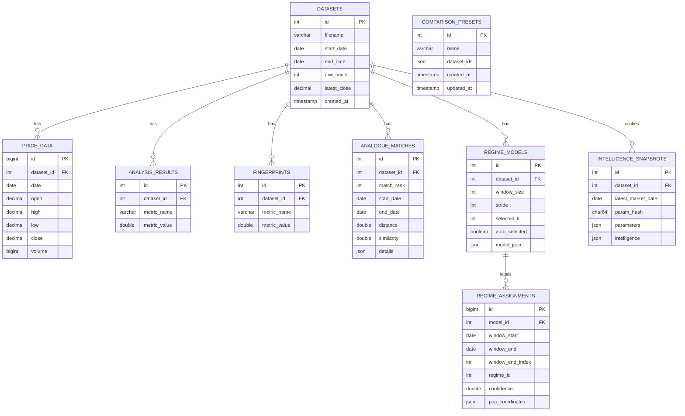

# QUANT VECTOR — Database Schema Reference

Source of truth: [`backend/schema.sql`](../backend/schema.sql).
The schema is **idempotent** (`CREATE ... IF NOT EXISTS` everywhere) and is applied
automatically at backend startup by `database.initialize_schema()`. Indexes are declared
inline because MySQL has no `CREATE INDEX IF NOT EXISTS`.

Engine: InnoDB, character set `utf8mb4`, database name `market_dna` (configurable via
`MYSQL_DATABASE`).

---

## Table Overview

| Table | Purpose | Rows per upload |
|---|---|---|
| `datasets` | One row per uploaded CSV (metadata) | 1 |
| `price_data` | All OHLCV bars of a dataset | N |
| `analysis_results` | Summary statistics of a dataset | ~16 |
| `fingerprints` | Numeric statistical fingerprint metrics | ~18 |
| `analogue_matches` | Top historical analogue windows | ≤ top_n |
| `regime_models` | Latest regime model of a dataset | 1 |
| `regime_assignments` | Per-window regime labels of a model | ~N/window_size |
| `intelligence_snapshots` | Cached intelligence payloads per parameter set | 1 per param hash |
| `comparison_presets` | Saved comparison selections (Phase 8) | user-defined |

---

## `datasets`

- **Purpose**: registry of uploaded datasets; the parent of every other analytics table.
- **Primary key**: `id INT AUTO_INCREMENT`
- **Important columns**:
  - `filename VARCHAR(255)` — original CSV filename
  - `start_date DATE`, `end_date DATE` — first/last trading date
  - `row_count INT UNSIGNED` — number of stored bars
  - `latest_close DECIMAL(18,6)` — last close, used by list views
  - `created_at TIMESTAMP DEFAULT CURRENT_TIMESTAMP`
- **Foreign keys**: none (root table).
- **Indexes**: clustered PK.

## `price_data`

- **Purpose**: canonical OHLCV storage, one row per trading day.
- **Primary key**: `id BIGINT AUTO_INCREMENT`
- **Important columns**: `dataset_id`, `date DATE`, `` `open` ``, `high`, `low`, `close DECIMAL(18,6)`, `volume BIGINT`.
  (`open` is quoted because it is an SQL keyword.)
- **Foreign key**: `fk_price_data_dataset → datasets(id) ON DELETE CASCADE`.
- **Indexes**: `idx_price_data_dataset_date (dataset_id, date)` — serves the two access patterns:
  "all prices for one dataset in date order" and point lookups by date.
- **Note on scale invariance**: storing prices as `DECIMAL(18,6)` rounds inputs to six decimal
  places. Correlation-style statistics are unaffected; covariance comparisons across rescaled
  copies differ only at floating-point rounding level (~1e-8).

## `analysis_results`

- **Purpose**: persisted headline summary metrics (`total_return`, `annualized_volatility`,
  `max_drawdown`, ...) computed once at upload time.
- **Primary key**: `id INT AUTO_INCREMENT`
- **Important columns**: `metric_name VARCHAR(100)`, `metric_value DOUBLE NULL`.
- **Foreign key**: `→ datasets(id) ON DELETE CASCADE`.
- **Indexes**: `UNIQUE uq_analysis_results_metric (dataset_id, metric_name)` — makes re-inserts
  idempotent and gives a dataset-prefix index for free.

## `fingerprints`

- **Purpose**: numeric statistical fingerprint of the *whole* history (Phase 3). Only numeric
  metrics are stored; categorical entries such as `ma20_ma50_relationship` remain API-only so the
  API response is never degraded by storage limitations.
- **Primary key**: `id INT AUTO_INCREMENT`
- **Columns**: same shape as `analysis_results` (`metric_name`, `metric_value DOUBLE NULL`).
- **Foreign key**: `→ datasets(id) ON DELETE CASCADE`.
- **Indexes**: `UNIQUE uq_fingerprints_metric (dataset_id, metric_name)`.

## `analogue_matches`

- **Purpose**: the top-N historical windows most similar to the current market window.
- **Primary key**: `id INT AUTO_INCREMENT`
- **Important columns**:
  - `match_rank INT` — 1 = most similar
  - `start_date`, `end_date` — the historical window
  - `distance DOUBLE`, `similarity DOUBLE` — ranking values
  - `details JSON` — full match payload (characteristics + forward outcomes)
- **Foreign key**: `→ datasets(id) ON DELETE CASCADE`.
- **Indexes**: `UNIQUE uq_analogue_matches_rank (dataset_id, match_rank)`.

## `regime_models`

- **Purpose**: latest KMeans/PCA regime model per dataset. A new run replaces the previous row,
  so exactly one current model exists per dataset.
- **Primary key**: `id INT AUTO_INCREMENT`
- **Important columns**:
  - `window_size INT`, `stride INT`, `selected_k INT`, `auto_selected BOOLEAN`
  - quality scores: `silhouette DOUBLE NULL`, `davies_bouldin DOUBLE NULL`
  - `pca_components INT`, `cumulative_explained_variance DOUBLE`
  - `model_json JSON` — complete reproducible response payload (everything except the timeline)
- **Foreign key**: `→ datasets(id) ON DELETE CASCADE`.
- **Indexes**: `INDEX idx_regime_models_dataset (dataset_id)`.

## `regime_assignments`

- **Purpose**: one row per sliding window of the model — which regime it belonged to and why.
- **Primary key**: `id BIGINT AUTO_INCREMENT`
- **Important columns**: `model_id`, `window_start/window_end DATE`, `window_end_index INT`,
  `regime_id INT`, `distance_to_centroid`, `confidence`, `pca_coordinates JSON`.
- **Foreign key**: `fk_regime_assignments_model → regime_models(id) ON DELETE CASCADE`
  (deleting a model removes its timeline automatically).
- **Indexes**: `UNIQUE uq_regime_assignment (model_id, window_end_index)`.

## `intelligence_snapshots`

- **Purpose**: result cache for the expensive intelligence layer. A snapshot is keyed by the
  parameter configuration that produced it.
- **Primary key**: `id INT AUTO_INCREMENT`
- **Important columns**:
  - `param_hash CHAR(64)` — SHA-256 over the canonical JSON of parameters
  - `parameters JSON` — human-readable copy of those parameters
  - `latest_market_date DATE` — dataset end date at generation time
  - `intelligence JSON` — full payload
- **Cache validity rule** (enforced in SQL): a snapshot is reusable only while
  `latest_market_date = datasets.end_date`. Because uploaded datasets are immutable, any change
  to data means a new dataset id; any change to request parameters means a new hash.
- **Foreign key**: `→ datasets(id) ON DELETE CASCADE`.
- **Indexes**: `UNIQUE uq_intelligence_params (dataset_id, param_hash)`.

## `comparison_presets`

- **Purpose**: named, saved dataset selections for the comparison workspace (global to this
  installation; no authentication by design).
- **Primary key**: `id INT AUTO_INCREMENT`
- **Important columns**: `name VARCHAR(120) NOT NULL`,
  `dataset_ids JSON NOT NULL` (array of dataset ids),
  `created_at`, `updated_at TIMESTAMP ON UPDATE CURRENT_TIMESTAMP`.
- **Foreign keys**: intentionally none. Presets must survive dataset deletion; stale ids are
  filtered when a preset is loaded in the UI.
- **Indexes**: clustered PK only (access patterns are "list all" / "get by id").

---

## Relationships

```
datasets (1) ──< price_data          (N)   cascade
datasets (1) ──< analysis_results    (N)   cascade
datasets (1) ──< fingerprints        (N)   cascade
datasets (1) ──< analogue_matches    (N)   cascade
datasets (1) ──< regime_models       (1*)  cascade   (* newest replaces old)
regime_models (1) ──< regime_assignments (N) cascade
datasets (1) ──< intelligence_snapshots  (N) cascade
comparison_presets                       — standalone (JSON references, no FK)
```



## Index Rationale

Only indexes that serve real queries exist:

- `(dataset_id, date)` on price rows covers both chronological reads and date lookups;
- every per-dataset child table has either a unique `(dataset_id, …)` index or an explicit
  `dataset_id` index, which also makes cascade deletes cheap;
- cache lookups use the unique `(dataset_id, param_hash)` prefix;
- `comparison_presets` needs nothing beyond its primary key (list-all / get-by-id).

No redundant multi-column duplicates of these prefixes were added.
